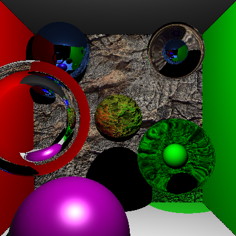
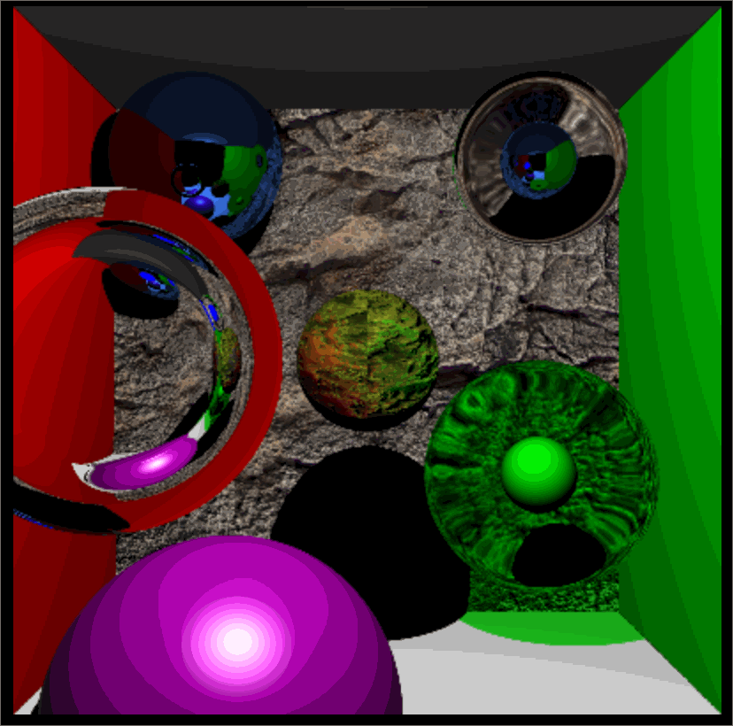
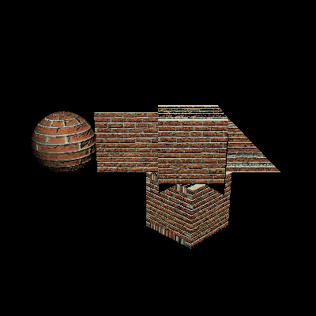
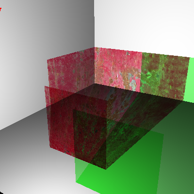
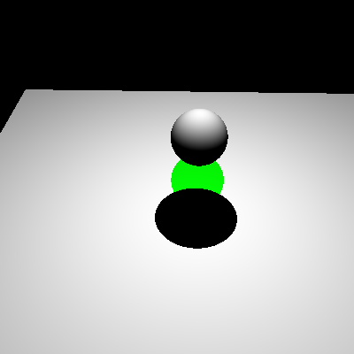
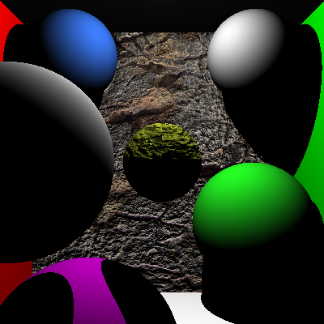

Ray Tracer 
======================

**University of Pennsylvania, CIS 561: Advanced Computer Graphics, course project**

Extra Credits
------------------------
Normal Map Implemented

AAx2 (default turn off, because will be severely stuttering during rendering,
     change const bool AAx2 to turn on)
     
     

Final Render Images
------------------------

transparent_containing_objects.json:

AA comparison:

all_shapes.json

stained_glass.json

transparent_shadow_test.json

cornell_box.json

